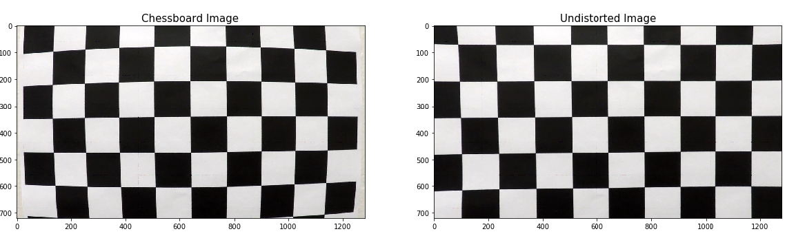
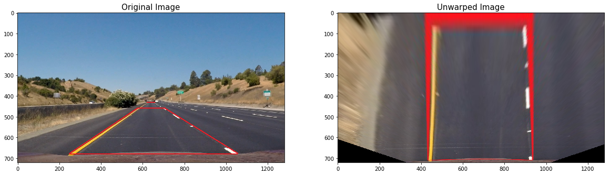
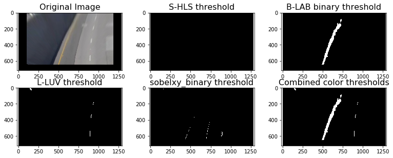
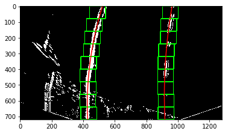
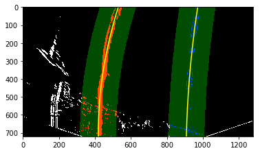
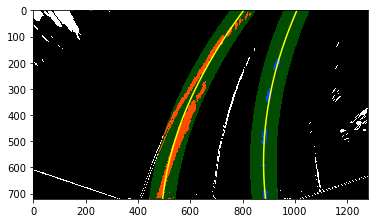
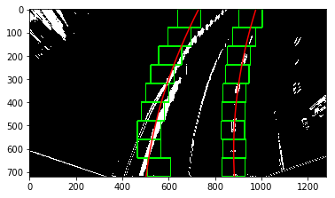
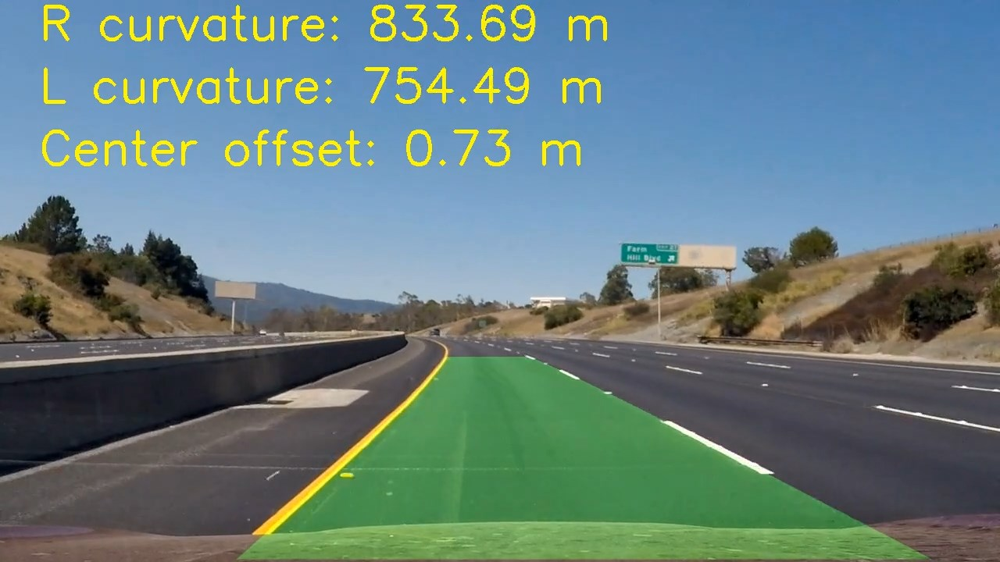

# P4: Advanced Lane Finding Project

## Objectives

* Compute the camera calibration matrix and distortion coefficients given a set of chessboard images.
* Apply a distortion correction to raw images.
* Use color transforms, gradients, etc., to create a thresholded binary image.
* Apply a perspective transform to rectify binary image ("birds-eye view").
* Detect lane pixels and fit to find the lane boundary.
* Determine the curvature of the lane and vehicle position with respect to center.
* Warp the detected lane boundaries back onto the original image.
* Output visual display of the lane boundaries and numerical estimation of lane curvature and vehicle position.

[//]: # (Image References)

[image1]: ./examples/undistort_output.png "Undistorted"
[image2]: ./test_images/test1.jpg "Road Transformed"
[image3]: ./examples/binary_combo_example.jpg "Binary Example"
[image4]: ./examples/warped_straight_lines.jpg "Warp Example"
[image5]: ./examples/color_fit_lines.jpg "Fit Visual"
[image6]: ./examples/example_output.jpg "Output"
[video1]: ./project_video.mp4 "Video"

## 1. Camera Calibration and image rectification
In this step, the parameters for lens distortion are found, so that any other image taken by the same camera can be undistorted. Usually, chessboard-like images taken from different perspectives are used for the lens calibration.
OpenCV already provides a function that finds those parameters. The inputs are the chessboard images, and the number of cross "+" intersections.

For this project, the number of columns, and row were 9, and 6, respectively.
The algorithm identifies the corners on each image, and relates them to find the correction parameters. After processing, those parameters are saved in *'camera_cal/calibration.p'*.

The code for this step can be found in the files *cameraCalibration.py* and *imageProcessing.py".
Images of the process are shown below.

## 2. Image rectification
In order to compute the real magnitude of the lane center offset and curvature radius, is better to have an orthogonal view, or "bird eye" view of the lane. This image rotation is called "image rectification". As in the last case, OpenCV already provides a function that can find the transformation matrices to compute this transformation. First, at least four points on each plane domain, called in this project, the *"unwarped plane"* and the *"warped plane"* has to be found. With those points, the program computes the matrices, which are stored in the file *'camera_cal/perspective.p'*. In the image below, the red trapezoid, and red rectangle are the same shape, but in different planes. Those for points are introduced to the function *perspectiveCal*, which outputs the transformation matrices *M*, and *Minv*.

The code for this step can also be found in the files *cameraCalibration.py* and *imageProcessing.py".

## 3. Image filtering

### a. Region of interest
After the image has been unwarped, the image is masked, to avoid introducing unnecesary artifacts and elements (like the hood of the car, for example) into the image processing algorithm.
Since the image is already rectified, a simple rectangular mask is enough.

	% This is the python code for the masking	
	vertices = np.array([[(0,660),(550, 450), (730,450), (imshape[1],660)]], dtype=np.int32)
    maskedImg = roi(imageFiltered,vertices)

### b. Color filtering
In the next step, the images is filterd in order to isolate, as best as possible, the line on the lane. Different colorspaces, and image gradient functions were used. Concretely, the Sobel operator in the **X** direction, combined with color thresholds in the LAB, HLS, and LUV colorspaces were examined. 

The sobelXY did a good job at identifying the lanes, even on low light conditions, but also detected other undesired artifacts. The L-channel in LUV did a good job at identitifying the whites, but did poorly on the yellows. An opposite situation hapenned with the B-channel in LAB, which did better at identifying the yellows. In order to get the best of each filter, they are finally combined on a single binary-image. The color filters added additional points to the sobel filter, an important issue for the next step, for line fitting. 

The code for this step can be found in the files *imageFilter.py* and *filterTest.py", and the result of the filters in the image below.

## 4. Line fitting and radius of curvature
The left and right lines on the lane are fitted to a second degree polynomial, as shown in the image below

Two search algorithms are used to find the point concentrations on the image frames. The first one is the function **lineFullSearch**, which look for the left and right concentration points. First, an histogram of the middle bottom area allows the identification of each line base position. On these two points, an small window (show in green on the image) start from the bottom, following the trail of each line. On every iteration (9 for the image shown), the algorithm identifies the major concentration of points at each window, and store that position. The window is repositioned on every iteration, based on the ** X coordinate** of the found centroid. The complete process is ilustrated on the image below.

The code for this step can be found in the files *findLines3.py*

The second algorithm, uses information from the previous one, in order to make a more localized and faster search. The algorithm is summarized in the function **lineGuidedSearch**, which used the information of the last fitted line equation. Then, it creates a localized search area (shown in translucent yellow= for both left, and right lines, as shown in the image below.

The code for this step can be found in the files *findLines3.py*

### Criterias to determine if the line was lost on the frame
It may happen that due to changing lighting conditions, the lines are not found, or are wrongly identified by the mentioned algorithms. On those cases, some failsafe were added for robustness.
Most of the time, it is desired that the pipeline uses the *guided search* algorithm; however, if the lines get too close, or too far away, the algorithm emits a flag to signal that the lines have been lost. Then, the pipeline returns to the *full search* algorithm. Also, if the number of points on any of the line comes below a certain number in more than 4 occasions, the pipeline also returns to the full search.

For example, in the image below, the two line came too close at the top, so the pipeline turns the *detected flag = False*, and the algorithm returns to the full search.

Returning to the full search algorithm.

In the full search algorithm, in order to reset the "undetected" flag, a centroid on at least 5 windows has to be successfully identified.

### Radius of curvature
This parameter is important, because it allows the computation of the maximum safe speed of the car. Higher radius allows the car to run faster, without the risk of over-steering due the friction loss. The computation of this parameters can also be found in *findLines3.py*. The code of the radius of curvature for a second degree polynomial can be found below. The curvature is evaluated at the middle of the image.

        y_eval = (binary_warped.shape[0]/2)*leftLine.y_factor  # evaluate at the middle of the figure
        leftLine.radius = ((1 + (2*leftLineFit_world[0]*y_eval + leftLineFit_world[1])**2)**1.5) / np.absolute(2*leftLineFit_world[0])
        rightLine.radius =  ((1 + (2*rightLineFit_world[0]*y_eval + rightLineFit_world[1])**2)**1.5) / np.absolute(2*rightLineFit_world[0])

### Smoothing and transition between frames
To reduce the oscillations in the detected area, a smoothing between the most recent and last fitted equation can be made. In this project, a smoothing factor is used to give more weight to either the most recent, or the last detected lanes. 

## 5. Drawing the detected lane region back to the unwarped image
Finally, the detected area is drawn over the original input image, to verify that the line identification has been successful. The code for drawing and writing the parameters over the input frame can be found in *drawingMethods.py*. 
First, a curved shape, using both identified lines equation is plotted, still in the unwarped plane. Then, this shape in unwarped, using the inverse transformation matrix *Minv*. Finally, this warped shape, show in translucent green in the figure, is overlayed over the original input image.

## 5. Video pipeline
Finally, all the steps from above are put together on the video pipeline function, which can be found on the files *pipeline.py* and *videoProssesing.py*. In here, the line lost failsafes are activated, since they depend upon the succesion of frames.

The animation for the project video is shown below. The file can be found on *output_images/project_video_output.mp4*

Here's a [link to the project video result](output_images/project_video_output.mp4)

And here's a [link to the challenge video result](output_images/challenge_video_output.mp4)

**Note:** The pipeline was also tested in the *harder_challenge_video*, but the results were not good. The video is also included in: output_images/harder_challenge_video_output.mp4 .

## 6. Conclusions and future work
In this project, a image processing pipeline for lane identification was developed. The pipeline included color filtering and masking, to deal with light changing conditions and other image artifacts. Then, a second degree was used to fit each, the left and right lines. The line search strategy was based on a histogram points concentration. The convolutional approach was also tested, but was not pursued further due to the poor performance in the initial tests.
The pipeline still present some problems in low contrast conditions. That can be noticed in the small jercking in the challenge video. The pipeline was not able to process the harder challenge video. 

A future work may include increasing the contrast ratio, even in challenging light conditions. Also, in order to make a it run on real time, some optimizations are necessary. One approach could be reducing the resolution of the video. Another, skip some frames. Finally, a C or C++ implementation may also contribute to reducing the processing time.
